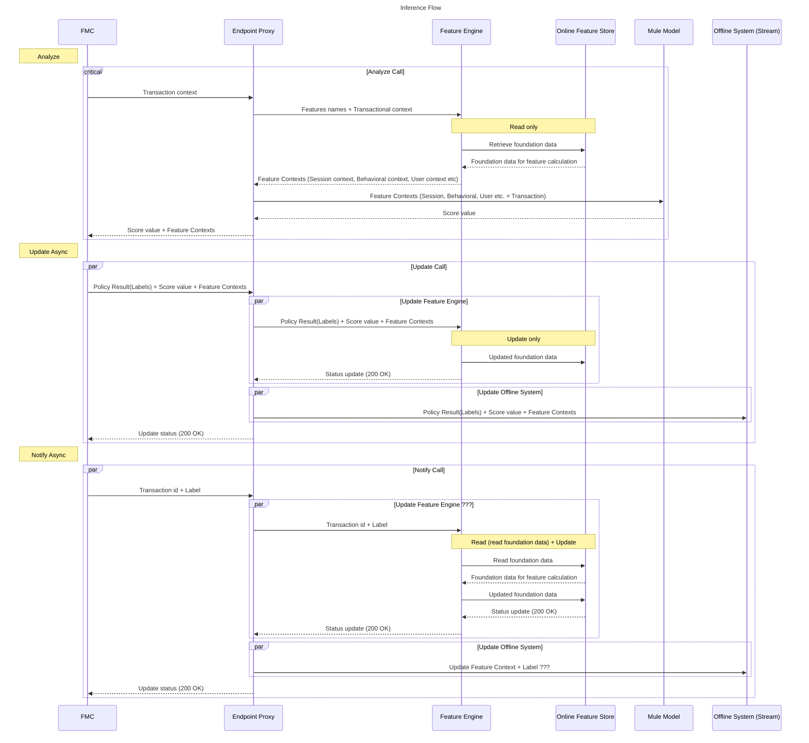

```mermaid
---
title: Inference Flow
---
sequenceDiagram
    Note left of FMC: Analyze
    critical Analyze Call
        FMC ->> Endpoint Proxy: Transaction context
        Endpoint Proxy ->> Feature Engine: Features names + Transactional context
        Note over Feature Engine, Online Feature Store: Read only
        Feature Engine ->> Online Feature Store: Retrieve foundation data
        Online Feature Store -->> Feature Engine: Foundation data for feature calculation
        Feature Engine -->> Endpoint Proxy: Feature Contexts (Session context, Behavioral context, User context etc)
        Endpoint Proxy ->> Mule Model: Feature Contexts (Session, Behavioral, User etc. + Transaction)
        Mule Model -->> Endpoint Proxy: Score value
        Endpoint Proxy -->> FMC: Score value + Feature Contexts
    end
    Note left of FMC: Update Async
    par Update Call
        FMC ->> Endpoint Proxy: Policy Result(Labels) + Score value + Feature Contexts
        par Update Feature Engine
            Endpoint Proxy ->> Feature Engine: Policy Result(Labels) + Score value + Feature Contexts
            Note over Feature Engine, Online Feature Store: Update only
            Feature Engine ->> Online Feature Store: Updated foundation data
            Feature Engine -->> Endpoint Proxy: Status update (200 OK)
        end
        par Update Offline System
            Endpoint Proxy ->> Offline System (Stream): Policy Result(Labels) + Score value + Feature Contexts
        end
        Endpoint Proxy -->> FMC: Update status (200 OK)
    end

    Note left of FMC: Notify Async
    par Notify Call
        FMC ->> Endpoint Proxy: Transaction id + Label
        par Update Feature Engine ???
            Endpoint Proxy ->> Feature Engine: Transaction id + Label
            Note over Feature Engine, Online Feature Store: Read (read foundation data) + Update
            Feature Engine ->> Online Feature Store: Read foundation data
            Online Feature Store -->> Feature Engine: Foundation data for feature calculation
            Feature Engine ->> Online Feature Store: Updated foundation data
            Online Feature Store -->> Feature Engine: Status update (200 OK)
            Feature Engine -->> Endpoint Proxy: Status update (200 OK)
        end
        par Update Offline System
            Endpoint Proxy ->> Offline System (Stream): Update Feature Context + Label ???
        end
        Endpoint Proxy -->> FMC: Update status (200 OK)
    end

```